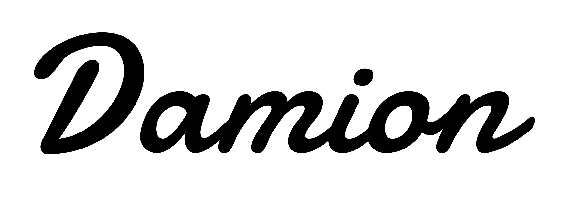

Damion
===============
by Vernon Adams

## About

Damion is a casual script face derived from some typical mid C20 casual typefaces such as that drawn by Max Kaufmann in 1936 for American Type Founders.

Damion has taken these and similar type forms and also added some of it's own forms to create a casual webfont for Display use on modern web pages.

## License

This Font Software is licensed under the SIL Open Font License, Version 1.1.
This license is copied below, and is also available with a FAQ at
https://openfontlicense.org
